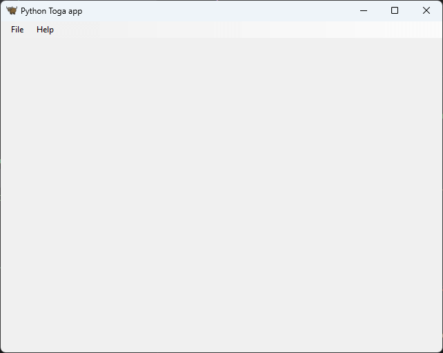
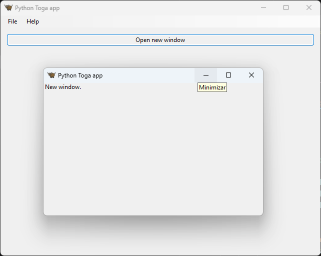

# Creating graphical interfaces with Python and Toga

Repository created to centralize tips, tutorials and code examples on building graphical interfaces with the [Python](https://www.python.org/) programming language and the [Toga](https://toga.readthedocs.io/en/stable/index.html) graphics tookit.

## 🤓 Author

Repository created with 💙 by [Renato Cruz](https://github.com/natorsc) 🤜🤛 Feel free to reach out!

Check out programming and technology content on:

A playlist I often listen to while studying or coding 😁:

---

## 💝 Donations

Thank you for your donation, it's through your support that I can maintain this content 😊.

### Github

https://github.com/sponsors/natorsc/

### Pix (Brazil)

**Key**: `b1839493-2afe-484d-9272-82a3e402b36f`

---

## 💡 Extra

- [Toga documentation](https://toga.readthedocs.io/en/stable/index.html).
- [Beeware](https://beeware.org/).
- [Briefcase](https://beeware.org/project/projects/tools/briefcase/).

---

## Widgets

### toga.Box

- [Code](./src/box/main.py).

### toga.Button

- [Code](./src/button/main.py).

### toga.ConfirmDialog

- [Code](./src/confirm-dialog/main.py).

### toga.ErrorDialog

- [Code](./src/error-dialog/main.py).

### toga.InfoDialog

- [Code](./src/info-dialog/main.py).

### toga.MainWindow

- [Code](./src/main-window/main.py).

### toga.OpenFileDialog

- [Code](./src/open-file-dialog/main.py).

### toga.OptionContainer

- [Code](./src/option-container/main.py).

### toga.QuestionDialog

- [Code](./src/question-dialog/main.py).

### toga.SaveFileDialog

- [Code](./src/save-file-dialog/main.py).

### toga.ScrollContainer

- [Code](./src/scroll-container/main.py).

### toga.SelectFolderDialog

- [Code](./src/select-folder-dialog/main.py).

### toga.SplitContainer

- [Code](./src/split-container/main.py).

### toga.StackTraceDialog

- [Code](./src/stack-trace-dialog/main.py).

### toga.Window

- [Code](./src/window/main.py).
